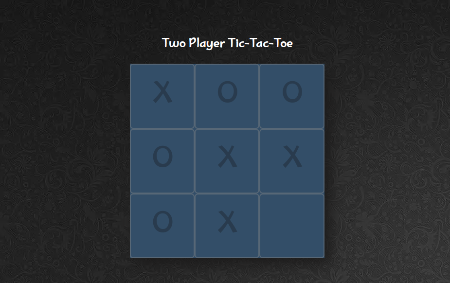
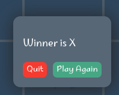
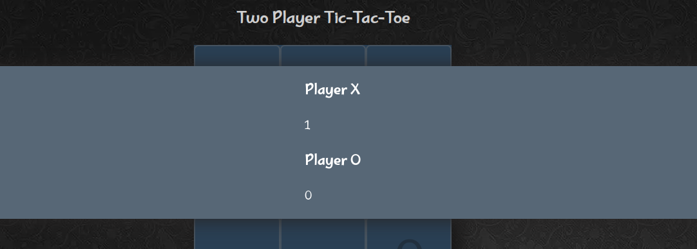

# TicTacToe

>*screenshot of the game play and setup

## Short Description💬👨‍🏫

This projects consititutes and builds on the practice of modular Javascript coding, where each section of code is an Object that does a specfic task.
It also uses Closures, IIEFE and factory functions.

It is a game famously known as [tic-tac-toe](https://en.wikipedia.org/wiki/Tic-tac-toe) or Noughts and crosses. To Win the game one has to make a successful connection of three spots of the Noughts or the crosses. The successful connection means a the Noughts or crosses make an alignment horizontally or vertically or cross-sectionally.

## Demo 🏃‍♂️

Try out the game [here](www.google.com)

## Features And Aspects 🎒

1. ### Winner Status
When a succeful connection is made A dialog message shows who Wown the Game.

- The user can play multiple times by clicking the `play again ` option and can end the game by clicking `quit`

2. ### Total Points
At the end of the game and the players are down playing and choos to `quit` Total points acquired by each player are shown

## Technologies and Tools 🧰

1. HTML
2. Vanilla CSS
3. Vanilla Javascript
4. Chrome Dev tools
5. Git
6. Google fonts
7. Figma And Figma community
8. Github Pages

## What I Learned 🧠

- Modular Javascript and Modula Programmng
- Factory Functions and IIFE
- Prototypal Inheritance

## Motivation 🔑

- To practice the principles of modular javasctipt

- Separating the DOM and javascript

## Credits 🤝
1. [Google Fonts](https://fonts.google.com/specimen/Neucha?preview.text=x)

2. [Figma Palettes](https://www.figma.com/file/kVuVeHcwCENaBn4kKAxhGt/Dashboard---Dark-And-Light-Modes-%7C-Color-Variables-(Community)?type=design&node-id=7-1619&mode=design&t=6qenh8RgcYwdf3eX-0)

## Future Updates 🔮

1. Addition of AI to play against
2. Revision of the User Interface